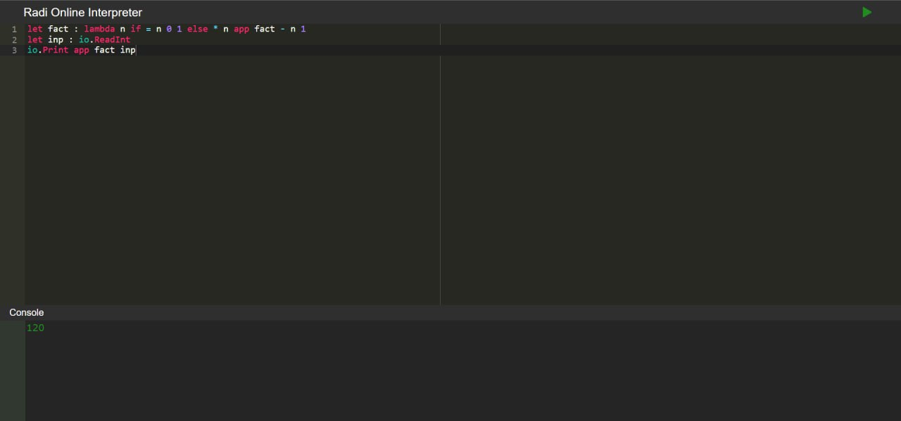
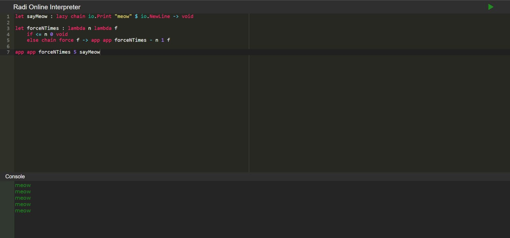
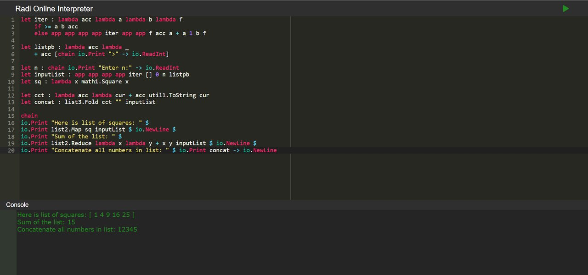

# Отчёт по курсовой работе
## по курсу "Функциональное программирование"


### Студенты :

| ФИО                  | Номер группы | Роль в проекте                                                      | Оценка      |
|----------------------|--------------|---------------------------------------------------------------------|-------------|
| Рамалданов Рустамхан | М8О-208Б-22  | Разработка интерпретатора, концепции языка, написание документации  |             |
| Мирошников Дмитрий   | М8О-210Б-22  | Разработка парсера, концепции языка, написание документации         |             |
| Железнов Илья        | М8О-210Б-22  | Разработка браузерного IDE для языка, концепции языка               |             |
| Калиниченко Артём    | М8О-210Б-22  | Написание итогового эссе и документации, разработка концепции языка |             |

> *Комментарии проверяющих*


## Введение

Язык radi - функциональный язык программирования с динамической типизацией. Все операторы в языке записываются в префиксной записи. Скобок в языке нет. В данном отчёте содержится описание возможностей, функций нашего языка и результатов дополнительного задания. Подробное описание применения подходов функционального программирования, с помощью которых был реализован язык radi, содержится в эссе, которое хранится в папке *essay*.

## Типы данных

В языке radi есть 6 основных типов данных:

1. Int - целое число
Пример в коде:
```
42
```
2. Float - число с плавающей точкой
Пример в коде:
```
42.1
42.
.024
```
3. String - строка переменной длины
Пример в коде:
```
"Meow meow"
```
4. Void - тип данных, обозначающий отсутствие значения
Пример в коде:
```
void
```
5. Lambda - лямбда-выражение
Пример в коде:
```
lambda x + x 2
```
6. List - список
Пример в коде:
```
[1, 2, 3]
let l : [1, 2, "radi", lambda x * 2 x]
```
Списки могут хранить произвольные выражения внутри

## Операторы

1. В языке присутствуют следующие унарные операторы:
"~" - унарный минус

2. Бинарные операторы:
"+" 
"-"
"*"
"/"
"<"
">"
"<="
">="
"="
"!="

## Конструкция app

Применяет функцию к аргументу.
Синтаксис:
```
app <f> <arg>
```
Если f - переменная типа лямбда, она вычисляется, подставляя arg в тело лямбды. Если f - не лямбда, ничего не происходит.

## Конструкция let

Выполняет два выражения последовательно, позволяет определять переменные и функции.
Синтаксис:
```
let <name> : <expr1> <expr2>
```
Сначала вычисляется expr1, результат присваивается переменной name, а после выполняется expr2,
в котором вместо name подставляется результат expr1.

## Конструкция if

Условная конструкция
Синтаксис:
```
if <cond-expr> <expr1> else <expr2>
```
Сначала вычисляется cond-expr, если результат является числом ноль, то вычисляется expr2,
в ином случае вычисляется expr1.

## lazy/force

Ключевое слово lazy позволяет создать выражение, которое будет вычислено, только если
мы явно этого потребуем. Ключевое слово force - требует вычисления ленивого выражения. 
Синтаксис:
```
lazy <expr>
force <expr>
```
Пример:
```
let sayMeow : lazy io.Print "meow"
force sayMeow
```

## Конструкция chain

Позволяет вычислить несколько выражений подряд. При этом вернется только результат последнего
выражения.
Синтаксис:
```
chain <exp1> $ <exp2> $ ... $ <exp-n> -> <final-exp>
```
Сначала все выражения exp1...expn вычисляются, потом возвращается результат final-exp.

## Встроенные функции

Язык имеет ряд встроенных функций для работы с вводом/выводом, математических вычислений, работы со списками и строками. Список всех встроенных функций приведен ниже:

1. io :
```
io.Print        : a' -> void       (a':int/float)
io.ReadInt      : void -> int                        
io.ReadString   : void -> string                        
io.ReadFloat    : void -> float        
io.NewLine      : void -> void         
```
2. math :
```
math1.Square    : a' -> a'         (a':int/float) 
math1.Sqrt      : float -> float
math1.Sin       : float -> float
math1.Cos       : float -> float
math1.Abs       : a' -> a'         (a':int/float)
math1.ToFloat   : a' -> float      (a':int/float)
math1.ToInt     : a' -> int        (a':int/float)

math2.Pow       : float -> float -> float  
```
3. list :
```
list1.Length    : a' list -> int
list1.Head      : a' list -> a'
list1.Tail      : a' list -> a' list
list1.IsEmpty   : a' list -> int

list2.Map       : (a' -> b') -> a' list -> b' list 
list2.Reduce    : (a' -> a' -> a') -> a' list -> a'

list3.Fold      : (a' -> b' -> a') -> a' -> b' list -> a'
```

4. util :
```
util1.ToString  : a' -> string     (a':int/float/string)
```

## Примеры программ 

Факториал
```
let fact : lambda n if = n 0 1 else * n app fact - n 1
chain io.Print "Enter number:" ->
let inp : io.ReadInt
io.Print app fact inp
```

Решение квадратного уравнения
```
chain io.Print "Enter a, b, c coefficients (each on new line):" $ io.NewLine ->
let f : lambda a lambda b lambda c 
    let d : - math1.Square b * * 4. a c
        if < d 0. chain io.Print "No roots" -> io.NewLine else
            chain io.Print "Roots: " -> 
            let x1 : / - ~ b math1.Sqrt d * 2. a
            let x2 : / + ~ b math1.Sqrt d * 2. a
            chain io.Print x1 $ io.Print " " $ io.Print x2 $ io.NewLine -> 
            void
let a : io.ReadFloat
let b : io.ReadFloat
let c : io.ReadFloat
app app app f a b c
```

Число сочетаний из n по k
```
let C : lambda n lambda k
    if > k n 0
    else if = n 0 1
    else if = k 0 1
    else + app app C - n 1 - k 1 app app C - n 1 k
chain io.Print "Enter n:" ->
let n : io.ReadInt
chain io.Print "Enter k:" ->
let k : io.ReadInt
io.Print app app C n k
```

Выполнение некоторой функции n раз
```
let sayMeow : lazy chain io.Print "meow" $ io.NewLine -> void

let forceNTimes : lambda n lambda f
    if <= n 0 void
    else chain force f -> app app forceNTimes - n 1 f

app app forceNTimes 5 sayMeow 
```

Возведение в квадрат элементов списка, сумма списка, конкатенация элементов списка
```
let iter : lambda acc lambda a lambda b lambda f
    if >= a b acc
    else app app app app iter app app f acc a + a 1 b f

let listpb : lambda acc lambda _
    + acc [chain io.Print ">" -> io.ReadInt]

let n : chain io.Print "Enter n:" -> io.ReadInt
let inputList : app app app app iter [] 0 n listpb
let sq : lambda x math1.Square x

let cct : lambda acc lambda cur + acc util1.ToString cur
let concat : list3.Fold cct "" inputList

chain
io.Print "Here is list of squares: " $
io.Print list2.Map sq inputList $ io.NewLine $
io.Print "Sum of the list: " $
io.Print list2.Reduce lambda x lambda y + x y inputList $ io.NewLine $
io.Print "Concatenate all numbers in list: " $ io.Print concat -> io.NewLine
```

Несколько дополнительных примеров программ содержатся в папке *examples*

## IDE

IDE языка radi построено на клиент-серверном взаимодейстии, в котором клиентом является веб-страница. В нём имеются два окна - редактор кода и консоль, в которую клиент пишет входные данные, а сервер - выходные. Сервер работает следующим образом : он получает на вход JSON-файл, состоящий из двух полей - текста в редакторе кода и текста, записанного через консоль. Код записывается в файл *main.radi*, в то время как консольный ввод пишется в *in.txt*. После выполнения кода программы осуществляется вывод результата в *out.txt* и консоль. Так же в нашем IDE реализована подсветка синтаксиса, для работы которой был реализован конечный автомат. Ниже приведены скришноты работы IDE для нескольких программ, описанных выше.

Факториал


Выполнение функции n раз


Обработка списка
